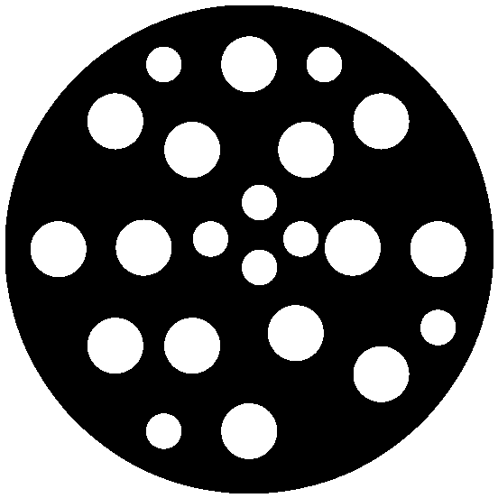
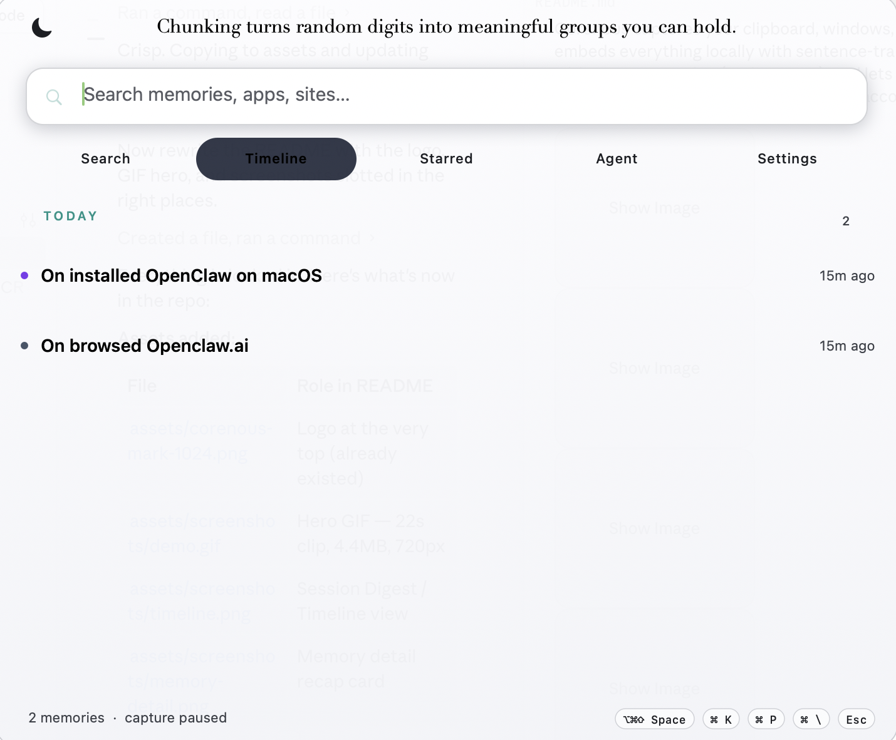
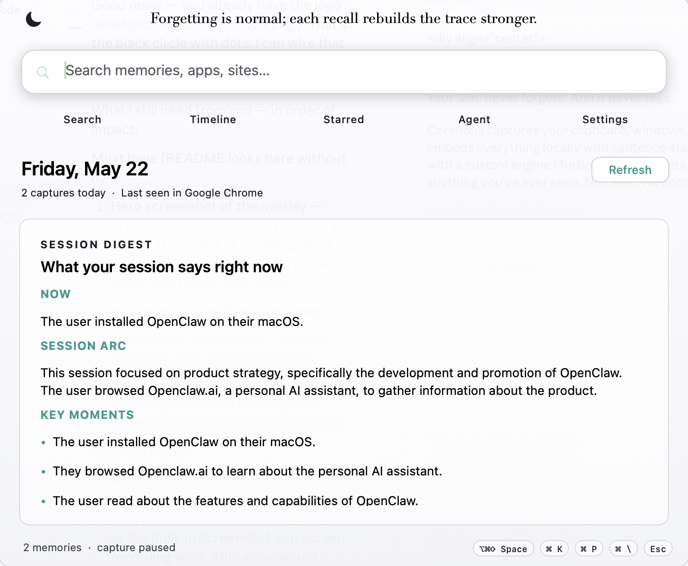

<div align="center">



# Corenous AI

**Your Mac never forgets. And it never tells.**

Corenous captures your clipboard, windows, and screen in real-time — embeds everything locally with sentence-transformers, compresses vectors with a custom engine (TurboQuant), and lets you search, ask, and rediscover anything you've ever seen. No cloud. No account. Nothing leaves your machine.

[](https://github.com/priyadarshiutkarsh/corenous/releases)
[](LICENSE)
[](https://github.com/priyadarshiutkarsh/corenous)
[](https://python.org)

<br/>


</div>

---

## Quick Start

```bash
git clone https://github.com/priyadarshiutkarsh/corenous.git
cd corenous
python3 -m venv .venv && source .venv/bin/activate && pip install -e .
corenous-ai start
```

Open the overlay: **Option + Command + Shift + Space**

**Requirements:** macOS 14+, Python 3.11+, Xcode Command Line Tools (`xcode-select --install`)

First run downloads the default model (~1.9 GB Llama 3.2 3B Q4_K_M) into `~/.corenous/models`. Grant Screen Recording and Accessibility permissions when prompted.

---

## What it does

- **Captures** clipboard changes, focused window text, and screen OCR via Apple Vision — entirely on-device
- **Embeds** every memory with sentence-transformers (all-MiniLM-L6-v2, 384-dim) and compresses with TurboQuant (58 bytes/vector)
- **Stores** everything in SQLite + NumPy — no external database, no cloud sync
- **Searches** semantically so "that article about neural nets from Tuesday" actually returns it
- **Chats** using a local GGUF model (Llama 3.2 3B default, Metal GPU, runs fully offline)
- **Vaults** sensitive content in AES-256 encrypted local storage
- **Bridges** to AI agents — Claude Desktop and Cursor can query your memory via MCP

<br/>

<div align="center">

<br/>
<sub>Timeline tab — session digest, key moments, and thread history, all generated locally</sub>
</div>

<br/>

<div align="center">

<br/>
<sub>Memory detail — AI-generated recap of exactly what you did, sourced from the local model</sub>
</div>

---

## Full Installation

| Step | Command |
|------|---------|
| Clone | `git clone https://github.com/priyadarshiutkarsh/corenous.git && cd corenous` |
| Virtualenv | `python3 -m venv .venv && source .venv/bin/activate` |
| Install | `pip install -e .` |
| Configure | Edit `config/settings.yaml` |
| Run | `corenous-ai start` |

**CLI reference**

| Command | Purpose |
|---------|---------|
| `corenous-ai start` | Start everything (daemon + app) |
| `corenous-ai daemon start / stop / status` | Control background capture |
| `corenous-ai app` | Menu bar + overlay only |
| `corenous-ai query "..."` | Semantic search from terminal |
| `corenous-ai add "..."` | Manually insert a memory |
| `corenous-ai agent serve` | MCP stdio tools for AI agents |
| `corenous-ai vault init / unlock` | Encrypted sensitive storage |
| `corenous-ai models list` | View / download GGUF presets |
| `corenous-ai compact` | Reclaim disk space (VACUUM + FTS optimize) |

---

## How it works

```
┌──────────────────────────────────────────────────────────┐
│                        Your Mac                          │
│                                                          │
│  ┌──────────────────┐      ┌────────────────────────┐   │
│  │  Menu bar + UI   │      │   Background daemon     │   │
│  │  search · chat   │      │ clipboard · window · OCR│   │
│  └────────┬─────────┘      └──────────┬─────────────┘   │
│           │                           │                  │
│           │      SQLite + vectors     │                  │
│           └──────────────┬────────────┘                  │
│                          ▼                               │
│             ┌────────────────────────────┐               │
│             │  memories.db               │               │
│             │  vectors.npy (TurboQuant)  │               │
│             │  ~/.corenous/models (GGUF) │               │
│             └────────────────────────────┘               │
└──────────────────────────────────────────────────────────┘
```

1. **Daemon** polls clipboard, window focus, and screen on configurable intervals
2. **Dedup** — identical or near-identical captures are skipped within a rolling window
3. **Embed** — sentence-transformers encodes each memory; TurboQuant compresses to 58 bytes
4. **Refine** — local LLM generates a heading + kicker for every capture (async, non-blocking)
5. **Search** — hybrid semantic + keyword search returns ranked results in milliseconds
6. **Chat** — overlay sends your question + top memories to the local model as grounded context

---

## Repository layout

| Path | What's here |
|------|-------------|
| `src/app/` | Menu bar, overlay, search UI (PyObjC + AppKit) |
| `src/monitor/` | Capture daemon, clipboard, window, screen/OCR |
| `src/memory/` | SQLite store, embedder, vector cache, search |
| `src/ai/` | Local GGUF inference, optional Groq remote |
| `src/turboquant/` | Custom vector quantization (polar + QJL) |
| `src/cli/` | Click CLI entry points |
| `src/privacy/` | Sensitive content detection and vault |
| `src/agent/` | MCP server for agent integrations |
| `config/settings.yaml` | All tunable knobs |
| `scripts/` | macOS bundle build helpers |

---

## Model presets

| Preset | Size | Notes |
|--------|------|-------|
| `llama-3.2-3b` | ~1.9 GB | Default — fast, low RAM |
| `qwen2.5-7b` | ~4.4 GB | Higher quality summaries |
| `phi-4-mini` | ~2.5 GB | Balanced speed / quality |

Switch with `local_llm.preset` in `config/settings.yaml`, then `corenous-ai models download <preset>`.

---

## Configuration

Edit `config/settings.yaml`:

| Key | What it controls |
|-----|-----------------|
| `monitoring.*` | Capture intervals and OCR resolution (biggest CPU levers) |
| `local_llm.preset` | Which GGUF model to use |
| `privacy.excluded_apps` | App names that are never captured |
| `chat_summary.provider` | `local` (offline) or `groq` (set `GROQ_API_KEY`) |
| `memory.refine_full` | Multi-pass AI narration — richer summaries, heavier background load |

---

## Privacy

Everything runs locally. No telemetry, no cloud sync, no account required.

- Excluded apps are never captured (`privacy.excluded_apps` in `config/settings.yaml`)
- Sensitive keywords always route to the AES-256 encrypted vault
- The vault requires an explicit `corenous-ai vault unlock` to read
- Delete `data/memories.db` + `data/vectors.npy` to wipe your memory store entirely

---

## License

MIT © 2026 Utkarsh Priyadarshi — see [LICENSE](LICENSE).
