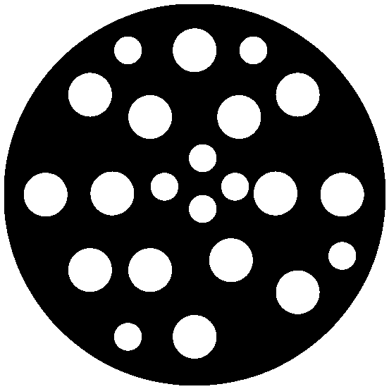
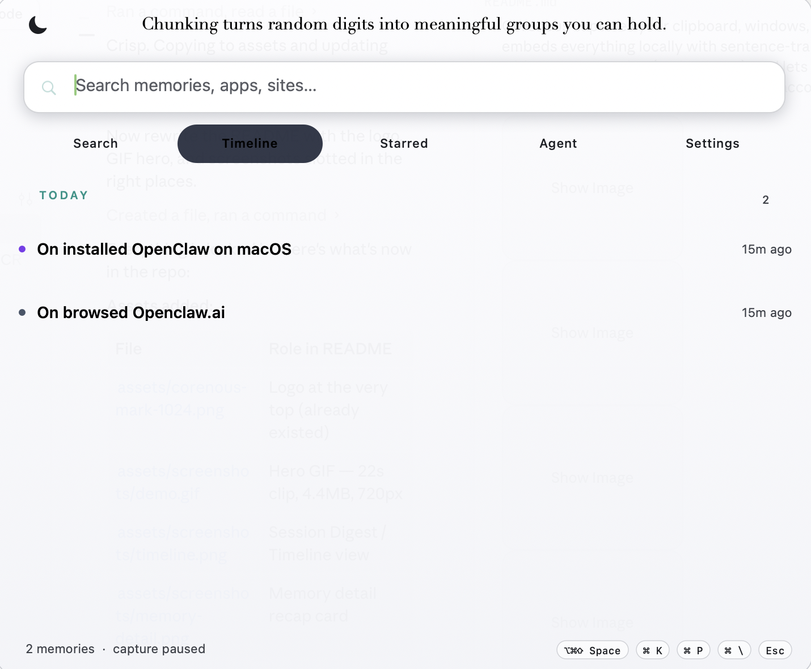
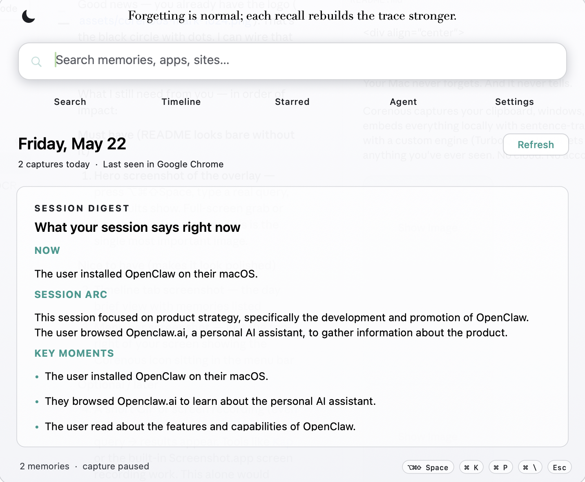

<div align="center">



# Corenous AI

**Your Mac never forgets. And it never tells.**

Corenous captures your clipboard, windows, and screen in real-time — embeds everything locally with sentence-transformers, compresses vectors with a custom engine (TurboQuant), and lets you search, ask, and rediscover anything you've ever seen. No cloud. No account. Nothing leaves your machine.

[](https://github.com/priyadarshiutkarsh/corenous/releases)
[](LICENSE)
[](https://github.com/priyadarshiutkarsh/corenous)
[](https://python.org)

<br/>


</div>

---

## Quick Start

```bash
git clone https://github.com/priyadarshiutkarsh/corenous.git
cd corenous
python3 -m venv .venv && source .venv/bin/activate && pip install -e .
corenous-ai start
```

Open the overlay: **Option + Command + Shift + Space**

**Requirements:** macOS 14+, Python 3.11+, Xcode Command Line Tools (`xcode-select --install`)

Place the local model — a 4-bit **Qwen2.5-VL 3B** (~3 GB, MLX) — in `~/.corenous/models/qwen2.5-vl-3b` (or point `$CORENOUS_VL_MODEL_DIR` at it). Grant Screen Recording and Accessibility permissions when prompted.

---

## What it does

- **Captures** clipboard changes, focused window text, and screen OCR via Apple Vision — entirely on-device
- **Embeds** every memory with sentence-transformers (all-MiniLM-L6-v2, 384-dim) and compresses with TurboQuant (58 bytes/vector)
- **Stores** everything in SQLite + NumPy — no external database, no cloud sync
- **Searches** semantically so "that article about neural nets from Tuesday" actually returns it
- **Chats** using a local vision-language model (Qwen2.5-VL 3B via Apple MLX, Metal GPU, runs fully offline)
- **Vaults** sensitive content in AES-256 encrypted local storage
- **Bridges** to AI agents — Claude Desktop and Cursor can search, read, and traverse your memory through read-only MCP tools

<br/>

<div align="center">

<br/>
<sub>Timeline tab — session digest, key moments, and thread history, all generated locally</sub>
</div>

<br/>

<div align="center">

<br/>
<sub>Memory detail — AI-generated recap of exactly what you did, sourced from the local model</sub>
</div>

---

## Full Installation

| Step | Command |
|------|---------|
| Clone | `git clone https://github.com/priyadarshiutkarsh/corenous.git && cd corenous` |
| Virtualenv | `python3 -m venv .venv && source .venv/bin/activate` |
| Install | `pip install -e .` |
| Configure | Edit `config/settings.yaml` |
| Run | `corenous-ai start` |

**CLI reference**

| Command | Purpose |
|---------|---------|
| `corenous-ai start` | Start everything (daemon + app) |
| `corenous-ai daemon start / stop / status` | Control background capture |
| `corenous-ai app` | Menu bar + overlay only |
| `corenous-ai query "..."` | Semantic search from terminal |
| `corenous-ai add "..."` | Manually insert a memory |
| `corenous-ai agent serve` | MCP stdio tools for AI agents |
| `corenous-ai vault init / unlock` | Encrypted sensitive storage |
| `corenous-ai models path` | Print the local model directory |
| `corenous-ai compact` | Reclaim disk space (VACUUM + FTS optimize) |
| `corenous-ai reindex` | Re-embed all memories after an embedding-model change |

---

## How it works

```
┌──────────────────────────────────────────────────────────┐
│                        Your Mac                          │
│                                                          │
│  ┌──────────────────┐      ┌────────────────────────┐   │
│  │  Menu bar + UI   │      │   Background daemon     │   │
│  │  search · chat   │      │ clipboard · window · OCR│   │
│  └────────┬─────────┘      └──────────┬─────────────┘   │
│           │                           │                  │
│           │      SQLite + vectors     │                  │
│           └──────────────┬────────────┘                  │
│                          ▼                               │
│             ┌────────────────────────────┐               │
│             │  memories.db               │               │
│             │  vectors.npy (TurboQuant)  │               │
│             │  ~/.corenous/models (MLX)  │               │
│             └────────────────────────────┘               │
└──────────────────────────────────────────────────────────┘
```

1. **Daemon** polls clipboard, window focus, and screen on configurable intervals
2. **Dedup** — identical or near-identical captures are skipped within a rolling window
3. **Embed** — sentence-transformers encodes each memory; TurboQuant compresses to 58 bytes
4. **Refine** — local LLM generates a heading + kicker for every capture (async, non-blocking)
5. **Search** — hybrid semantic + keyword search returns ranked results in milliseconds
6. **Chat** — overlay sends your question + top memories to the local model as grounded context

---

## Repository layout

| Path | What's here |
|------|-------------|
| `src/app/` | Menu bar, overlay, search UI (PyObjC + AppKit) |
| `src/monitor/` | Capture daemon, clipboard, window, screen/OCR |
| `src/memory/` | SQLite store, embedder, vector cache, search |
| `src/ai/` | Local Qwen2.5-VL inference (MLX), optional remote provider |
| `src/turboquant/` | Custom vector quantization (polar + QJL) |
| `src/cli/` | Click CLI entry points |
| `src/privacy/` | Sensitive content detection and vault |
| `src/agent/` | MCP server for agent integrations |
| `config/settings.yaml` | All tunable knobs |
| `scripts/` | macOS bundle build helpers |

---

## Local model

One on-device brain handles everything — capture summaries, digests, sensitivity checks, and chat:

| Model | Size | Runtime |
|-------|------|---------|
| Qwen2.5-VL 3B (4-bit) | ~3 GB | Apple MLX (Metal) |

Both text and screenshot prompts route through the same vision-language model, so an 8 GB Mac never juggles two sets of weights. Place the weights in `~/.corenous/models/qwen2.5-vl-3b`, or set `$CORENOUS_VL_MODEL_DIR` to a directory of your own. Run `corenous-ai models path` to confirm where corenous is looking.

---

## MCP tools

`corenous-ai agent serve` exposes a read-only MCP server (stdio) so agents like Claude Desktop and Cursor can query your second brain. Nothing it exposes can mutate your memories.

| Tool | What it does |
|------|--------------|
| `search_memories` | Hybrid semantic + keyword search across all memories |
| `list_recent_memories` | The most recent captures in reverse chronological order |
| `get_memory` | Full content and metadata for one memory by id |
| `find_related_memories` | Semantic neighbours of a given memory |
| `corenous://stats` | Resource — store size and latest capture time |

---

## Configuration

Edit `config/settings.yaml`:

| Key | What it controls |
|-----|-----------------|
| `monitoring.*` | Capture intervals and OCR resolution (biggest CPU levers) |
| `privacy.excluded_apps` | App names that are never captured |
| `chat_summary.provider` | `local` (offline) or `groq` (set `GROQ_API_KEY`) |
| `memory.refine_summaries` | AI heading + kicker per capture (off = raw captures only) |
| `memory.refine_full` | Multi-pass AI narration — richer summaries, heavier background load |

---

## Privacy

Everything runs locally. No telemetry, no cloud sync, no account required.

- Excluded apps are never captured (`privacy.excluded_apps` in `config/settings.yaml`)
- Sensitive keywords always route to the AES-256 encrypted vault
- The vault requires an explicit `corenous-ai vault unlock` to read
- Delete `data/memories.db` + `data/vectors.npy` to wipe your memory store entirely
- Email addresses and phone numbers in normal captures are redacted inline; higher-risk secrets (keys, passwords, SSNs, card numbers) route the whole memory to the vault

---

## Performance

Corenous is built to stay invisible on an 8 GB Mac. The capture daemon runs at background OS priority (nice + QoS background + throttled disk I/O), captures clipboard and window text only on change, and skips the expensive screen OCR pass while you are idle on an unchanged window.

It targets a stated background budget — roughly **under 3 GB RAM** and **under 25% of total CPU** — checked by a watchdog that samples the daemon's own footprint and logs a warning when it sustains over budget. The budget and watchdog are tunable under `performance` in `config/settings.yaml`.

---

## License

MIT © 2026 Utkarsh Priyadarshi — see [LICENSE](LICENSE).
